# Biometrics-Authenticated Key Exchange for Secure Messaging  -- 安全消息传递的基于生物特征的认证密钥交换

## 摘要

**Authenticated Key Exchange (AKE) protocol** ---- extension---->>>> **Biometrics-Authenticated Key Exchange (BAKE)**

关键词 ：• Security and privacy → Biometrics; Security protocols. Authenticated key exchange; biometrics; secure messaging; fuzzy
extractor; verifiable secret sharing

认证密钥交换； 生物鉴别； 安全消息传递； 模糊提取器；可验证秘密共享

##  AKE  

> Authenticated Key Exchange (AKE) or Authenticated Key Agreement is the exchange of session key in a key exchange protocol which also authenticates the identities of parties involved in key exchange.[1]  wiki百科
>
> 验证性密钥交换（AKE）或验证性密钥协议是指在**密钥交换协议中交换会话密钥，同时验证参与密钥交换的各方的身份。**

> ​	 Diffie, W.; van Oorschot, P.; Wiener, M. (June 1992). **"Authentication and authenticated key exchanges".** *Designs, Codes and Cryptography*. **2** (2):  
>
> 1992年发表的这篇论文提出了ake这个概念， 为什么我们**需要验证性密钥交换？** 
>
> abstract：我们讨论了提供认证密钥交换的双方相互认证协议，重点是那些使用非对称技术的协议。我们介绍了一个简单、高效的协议，即站对站（STS）协议，对其进行了详细研究，并考虑到与现有协议的关系。安全协议的定义，并讨论了安全协议的理想特征。

**认证密钥交换（AKE）是一种会同时认证相关方身份的密钥交换协议**，比如个人 WiFi 通常就会使用 password-authenticated key agreement (PAKE)，而如果你连接的是公开 WiFi，则会使用匿名密钥交换协议。

用于KE的密码算法：

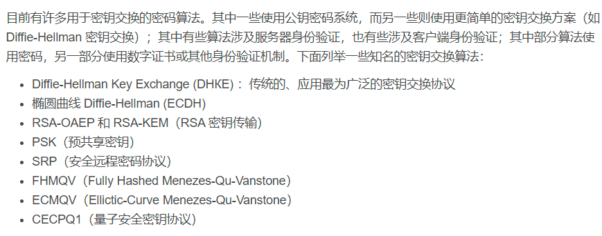

##  信息传递

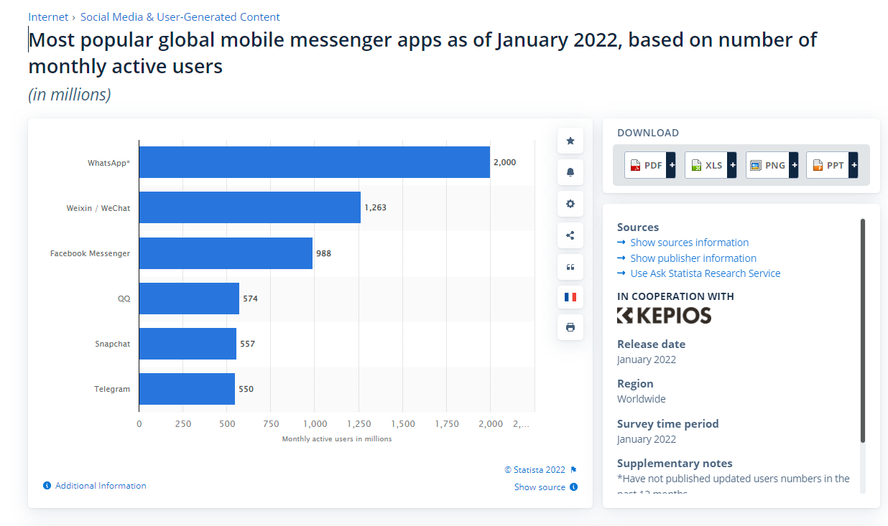

社交消息应用以其便捷性成为日常交流的主流手段，这个图示2022年一月份全球最流行社交app排名，从中可以看出 whats app高居第一---等等。

几乎所有的社交App都是端到端通讯的，**其中 whatsApp、FaceBook是端到端加密，而微信、qq不能进行端到端加密**（根据《中华人民共和国反恐怖主义法》第18条，通讯软件作为互联网服务提供者需要留后门。第19条也规定需要防止含有恐怖主义极端主义内容的信息传播。国家相关部门《调查函回函》里，微信说自己是“点对点” “加密” 而且腾讯服务器不保存历史记录）。

 

 [关于 WhatsApp 端到端加密技术](https://faq.whatsapp.com/791574747982248/?helpref=uf_share)

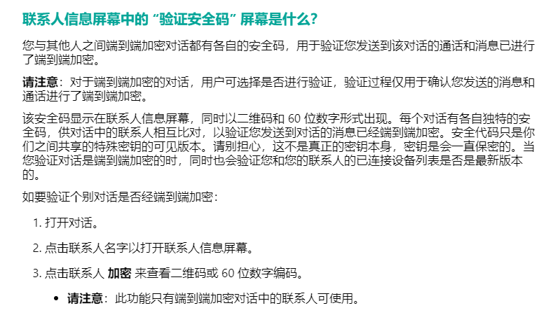

所以本论文的BAKE只能用在这些国外App上了，我们看  [关于 WhatsApp 端到端加密技术](https://faq.whatsapp.com/791574747982248/?helpref=uf_share)，其中对于加密技术的描述可以很显然的看出采用的是传统的公钥技术。

**其中对于每一个会话都会生成一对特殊密匙，外部显示为安全代码**（该安全码显示在联系人信息屏幕，同时以二维码和 60 位数字形式出现。），安全代码只是你们之间共享的特殊密钥的可见版本。**请别担心，这不是真正的密钥本身，密钥是会一直保密的。**当您验证对话是端到端加密的时，同时也会验证您和您的联系人的已连接设备列表是否是最新版本的。

粗略地说，每个参与者生成一对公钥和秘密密钥，并将公钥发布给另一个参与者。然后，两个通信参与者可以基于**他们的密钥执行**（可能是异步的）AKE协议。实际上目前这些传统AKE协议在实践中不适用于安全消息传递。第一、由于密钥通常存储在终端中，密匙及其容易被窃取。其次， 消息传递应用程序不能立即确定秘密密钥是否被克隆[15]。第三，当参与者丢失或更换终端时，很难及时更新公钥-秘密密钥对，因为每个新的公钥在启用之前都需要通过带外方式进行认证。

##  指纹、虹膜、耳道

### 耳道 

> 	Yang Gao, Wei Wang, Vir V. Phoha, Wei Sun, and Zhanpeng Jin. 2019. EarEcho:
> Using Ear Canal Echo for Wearable Authentication. Proc. ACM Interact. Mob.
> Wearable Ubiquitous Technol. 3, 3 (2019), 81:1–81:24.

本文提出了一种新的身份认证方案Earecho，方案通过商品耳机上集成的麦克风和扬声器来利用用户耳道中的声学特性。 我们验证了从听筒扬声器发射的音频和从麦克风接收的回波之间提取的声学特征可以作为用户认证的唯一和可靠的标识符。 在声学信号预处理后，基于传递函数的特征被送入支持向量机分类器进行身份验证。 结果表明，Earecho的查全率和查准率分别为97.55%和97.57%。

虞启贤的结论：想法很好，但很扯淡，准确率有点低、实用性不高、有待改进。

### 指纹

已经相当成熟的技术了，　指纹识别技术很重要的一个指标就是准确率，而提高指纹识别准确率的核心在于能否更准确、高效的采集指纹图像（当然也可以通过后期算法来提升，但是提升的效果有限）。目前指纹识别采集技术主要有三种方式：**光学识别、[电容传感器](https://link.zhihu.com/?target=https%3A//www.sensorexpert.com.cn/sensors/_/62-74/p1.html)识别、生物射频识别。**

（目前，用户如果按照事先指定的文本读出内容，**声纹识别准确率已达99.8%**；如不照读事先指定的文本内容而随意发声，声纹识别准确率也能达到99.1%。静脉识别的准确率比指纹识别还高。实验显示，其无法识别的几率仅有0.01%，识别错误的概率则只有0.00008%，识别率已经达到了99.9%。）

### 虹膜

[现代虹膜识别技术的应用和前景 - 知乎 (zhihu.com)](https://zhuanlan.zhihu.com/p/112922031)

膜在胎儿发育阶段形成后，在整个生命历程中将是保持不变的。这些特征决定了虹膜特征的唯一性，同时也决定了身份识别的唯一性。因此，可以将眼睛的虹膜特征作为每个人的身份识别对象。

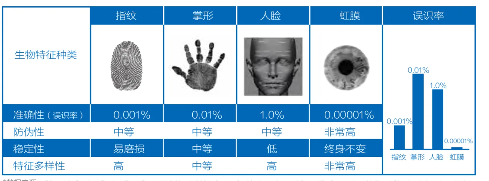

**虹膜+人脸 （2D、3D、可见光、红外光）**是各种生物特征中“精度最高、防伪性最优、便利性最好、整体性最佳” 的组合，兼顾安全性和便利性。

### 人脸（2D、3D）

## 2. BAKE  (生物识别的AKE--指纹、虹膜)

在本文中，我们提出了一个生物特征认证密钥交换(BAKE)框架，在该框架中，一个秘密密钥是由用户的生物特征导出的，而这些特征是不需要存储的。 为了保护用户的生物特征隐私和实现一轮密钥交换，我们提出了一种非对称模糊封装机制(AFEM),该机制使用由生物特征密钥派生的公钥对消息进行封装，使得只有相似的密钥才能对消息进行解封装。 为了证明其实用性，我们给出了两种生物特征密钥的AFEM构造，并用虹膜和指纹实例化了它们，分别。 我们对Bake进行了安全性分析，并通过大量的实验证明了它的性能。

在本文中，我们试图设计一个生物特征认证密钥交换(BAKE)框架，参与者根据她/他的生物特征生成秘密密钥和相应的公开密钥。 这个框架的一个简单的优点是，会话密钥是为经过身份验证的用户协商的，而不是经过身份验证的随机公钥。 由于在需要时可以基于生物特征来生成密钥，因此密钥（和生物特征）从不存储在终端中，并且在更换终端时不需要更新密钥和相应的公钥。 主要缺点是生物特征是永久性的，这意味着密钥泄露后无法更新。 幸运的是，窃取生物特征并不那么简单，因为许多生物特征（例如，虹膜[28]和耳道尺寸[25])需要专用设备在很短的距离内捕捉。 即使是为了窃取指纹，对手也需要接触到受害者接触过的东西。 此外，消息应用程序可以通过研究良好的活性检测技术来消除生物特征克隆和重放攻击[2,40,53,55,57]。

 

我们设计的主要挑战是根据数据保护法规（如通用数据保护法规(GDPR)）的要求保护参与者的生物特征，同时容忍生物特征中的噪声。

我们注意到Erwig等人提出了一个高度相关的工作，称为模糊非对称**口令认证密钥交换（FuzzyAPAKE**）。 [21]。 然而，他们的解决方案有两个局限性**。首先，它们要求通信参与者多次运行交互式密码原语（例如，不经意的传输），这导致了较大的通信开销，并且不适用于参与者不同时在线的非同步场景。** 其次，它**们要求生物特征表示应该是旋转不变的比特串，这意味着即使捕获的生物特征图像被旋转也可以提取出sim-ilar串**。 一些生物特征表示（例如，指纹[31]， 最常见的指纹表示）不满足旋转不变特性。

​	**为了解决非同步问题，我们提出了一种非对称模糊封装机制****(AFEM)。**该机制使用一个成员的生物特征公钥封装消息，只有具有相似生物特征的参与者才能获得消息。 在AFEM的基础上，我们提出了一个BAKE框架，其认证密钥交换阶段为一轮原型。 为了解决旋转不变问题，我们分别针对生物特征向量和生物特征向量集提出了两种AFEM结构。 其关键在于许多生物特征是由离散点组成的，通过这些离散点之间的相对关系可以提取出旋转不变的生物特征向量集。

### 主要贡献：
1.	提出了一种新的非对称密码协议，称为生物特征认证密钥交换，其中秘密密钥来自生物特征。
2.	针对安全消息传递的异步性和生物特征密钥类型的多样性，提出了一种非对称模糊封装机制，并分别构造了生物特征向量和生物特征向量集。
3.	我们实例化了两个生物特征认证的密钥交换原型：虹膜和指纹。
	具体地说，我们对虹膜采用了最常见的IRISCode[16]，并对指纹设计了旋转不变的表示。 我们对我们的两个实例进行实验。 该协议在真实虹膜数据集上的运行时间小于0.2s，在真实指纹数据集上的运行时间小于0.5s，比Fuzzy Apake[21]至少快2000倍。我们的两个实例的通信开销约为12.2KB和2.7KB，比Fuzzy APAKE至少低50倍。

虞启贤的结论： 前两点结论提出了想法，最重要的是对生物特征认证的密钥交换....。
前两点实用性不是很高？具体再细想.

### 3.BAKE建模

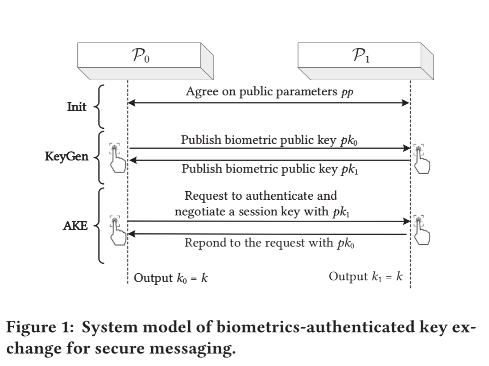

本文旨在为端到端的安全消息传递提供一种**双向生物特征认证密钥交换(BAKE)**，如图一所示，发起会话请求的发送方P0和响应该请求的接收方P1，其中用户是参与信息传递的人，终端是发送消息的设备，Bake协议是一种非对称密码学原语，其中从用户的生物特征（如虹膜或指纹）导出密钥，从相应的密钥导出公钥。

如图所示，Bake有三个阶段：

1. 初始化（init）阶段，两个参与者同意一组公共参数来初始化整个系统。
2. 在密钥生成（KeyGen）阶段，每个参与者基于他们的生物特征生成**公钥**，并将**公钥发送给另一个参与者**。
3. 在**AKE（认证密匙交互）阶段，**发送方向接收方请求彼此认证并协商可用于**建立安全信道的会话密钥****，参与者需要她/他的生物特征和其他参与者的公钥作为该阶段的输入。

#### 3.1 BAKE protocol设计目标
-	相互验证： 两个参与者在实际消息传递之前使用生物特征来相互认证
-	安全密钥建立：商定一致的会话密钥在发送者和接收者之间，并且这个会话只能二者相互访问
-	生物识别隐私： 任何人，包括通信参与者，不能从协议中获得参与者的生物识别特征。 从协议中获取参与者的生物特征。
-	高性能：计算与通信，Bake的开销应该很低

#### 3.2 ASYMMETRIC FUZZY ENCAPSULATION MECHANISM 非对称模糊封装机制
为了实现Bake协议的设计目标，设计了 AFEM。
我们的BAKE构造的核心思想**是从随机字符串中导出一个会话密钥，这些字符串只有具有正确生物特征的参与者才能访问。**为此，我们提出了一种称为非对称模糊封装机制(AFEM)的密码原语，**它将消息封装为一个公共的与目标密钥相对应的密钥。 只有参与者谁拥有与目标密钥接近的密钥，就可以获得来自封装消息的随机字符串。**

##### 3.2.1  AFEM语法	

**非对称模糊封装机制AFEM是由四个概率多项式时间(PPT)算法(SETUT、PUBGEN、ENC、DEC)组成的元组，**满足以下语法的正确性。

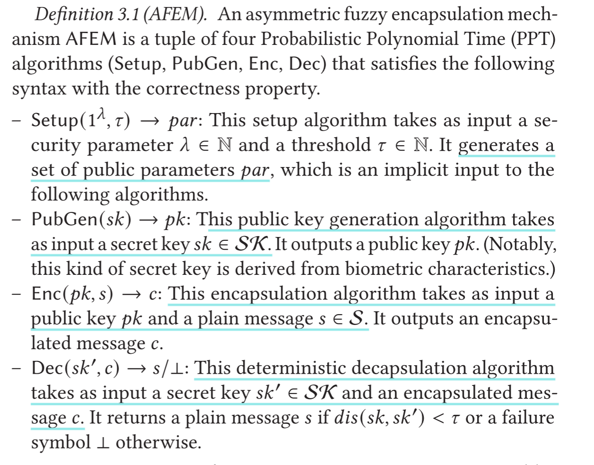

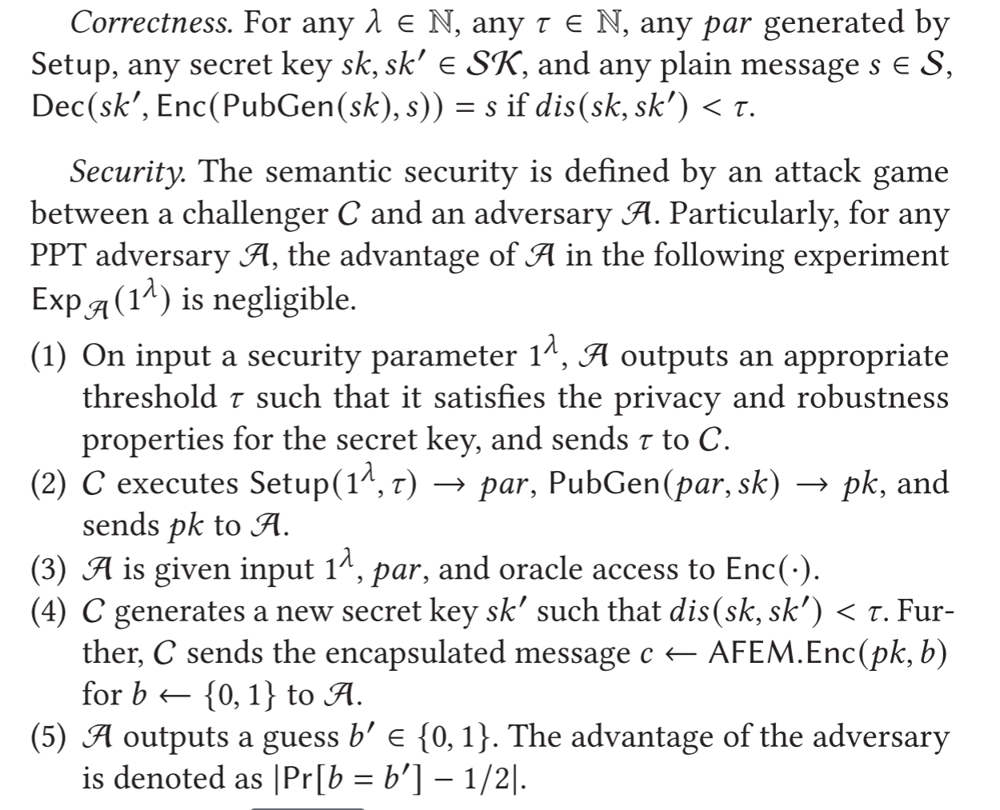

##### 3.2.2 生物特征向量的构造

我们提出了**第一个以生物特征向量的形式构造密钥的AFEM结构**，这意味着参与者的生物特征可以转换成字符串。

##### 3.2.3生物特征向量集的构造

3.2.1 到 3.2.3 浅浅的说一下，这三个部分让Bake的三个阶段变得具体

##### bake 的具体过程:

**我们的BAKE框架涉及两个参与者在不安全的信道上通信，由三个阶段组成：初始化(INIT)阶段、密钥生成(KEYGEN)阶段和认证密钥交换(AKE)阶段。** 我们框架的核心思想是从**两个参与者生成的随机字符串中派生用于安全消息传递的会话密钥**。 为了安全地将一个参与者生成的随机字符串传输到另一个参与者，**我们采用AFEM方案对该字符串进行封装**。 身份验证是在参与者试图解封装接收的封装字符串时隐式执行的。 Bake框架的细节如图2所示。

1. **初始化阶段：**此阶段提供其他阶段所需的所有公共参数。 具体地说，**P0和P1必须在基本参数上达成一致，即安全参数和阈值**。 然后，调用设置算法AFEM.Setup来生成AFEM的公共参数。 最后，BAKE的公共参数被设置为并且对两个参与者都是可访问的。在现实世界的应用程序（例如，安全消息传递）中，**服务提供商可以生成公共参数并将其发布在公告板上或将其编码为软件**，以便每个参与者都可以访问它们。
2. **密钥生成阶段：**在这个阶段中，**每个参与者根据她/他的生物特征生成一个公钥，并将其发送给另一个参与者。** 具体地说，p(∈0,1}）根据生物特征生成一个密钥，下面两个小节将对其进行实例化。生成公钥后，最后，P0通过一个**经过身份验证的通道**将公钥发送给P1，这意味着对手不能修改该公钥。 请注意，**对经过身份验证的信道的要求**对于所有经过身份验证的密钥交换协议都是必不可少的[6]。在实际应用中，通过**公钥基础设施(PKI)**技术[52]可以实现经过认证的信**道，在该技术中，权威生成证书以绑定身份和公钥，消息应用程序还建议使用带外方式来验证公钥，例如比较公钥指纹和扫描快速响应(QR)代码[44]。**
   1. **AKE阶段：**此阶段使**双方参与者能够相互验证并协商会话密钥。** 具体地说，P{0，1}首先选择一个随机消息si。然后，si通过AFEM算法封装成ci。在接收到对方的c1-i后，Pi基于生物特征生成一个密钥ski，可以使用AFEM的解封装算法解封装c1-i来得到s1-i。最后，P通过哈希函数计算**会话密钥k。**

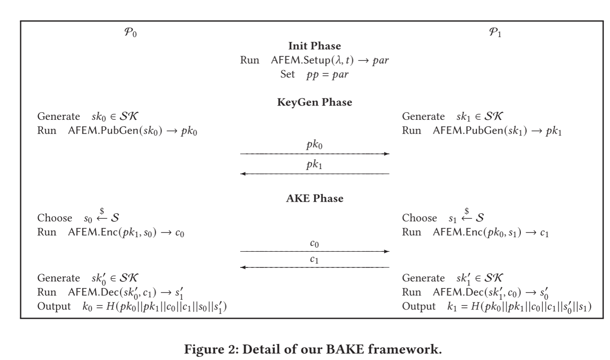

**提出了以生物特征向量集形式构造密钥的第二种AFEM结构，这意味着参与者的生物特征可以转换成一组字符串。 假定秘密密钥为={u1,...,u}，其中u∈{0,1}*for[1,],封闭度由集差定义，我们给出如下的技术描述和构造。**

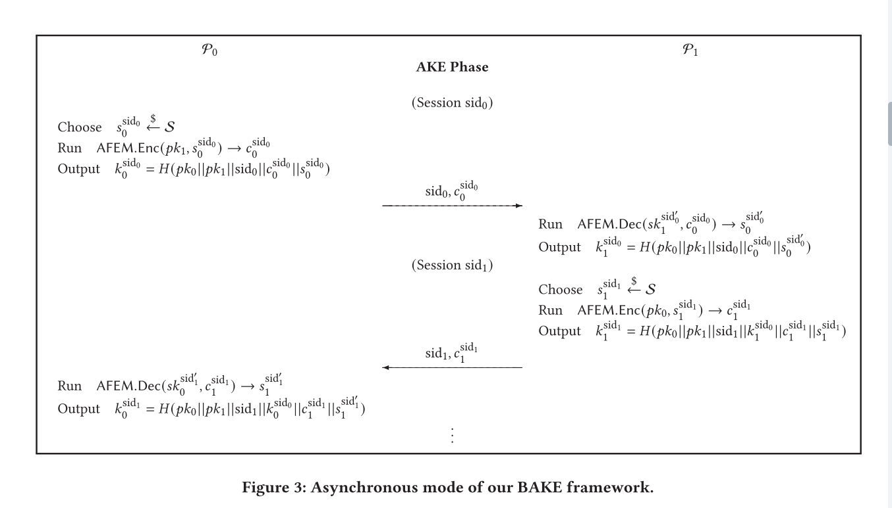

##### 3.3.4 来自虹膜的密钥

Iriscode[16]是目前应用最广泛的虹膜识别方法，具有匹配速度快、精度高等优点。 超过6000万人正在使用IRiscode进行虹膜识别，许多其他生物识别算法都是从IRiscode扩展而来的[16]。 通常，**虹膜识别是通过计算两个虹膜码之间的汉明距离来实现的**。 **在Bake中，IRISCode适合于我们的第一个AFEM构造的实例化，**该构造将在第3.2节中说明。

虹膜图像经过定位、分割和归一化后被转换成随机纹理，然后被编码成2048比特的流[17]。 为了构造3.2节中AFEM构造的有效密钥，应该将2048位虹膜码转换为向量。 我们自然采用了一个简单的解决方案，将2048位的虹膜码分解成组成虹膜向量的元素。 如图4所示，我们将第一个2048/bits作为第一个元素，将第二个2048/bits作为第二个元素，依此类推。 最后，我们得到一个虹膜向量V={v1,...,vm}。

**由于捕获偏差，AFEM的解码算法可能会失败，即使两个虹膜来自同一个用户.为了解决这个问题，我们期望找到一种算法(·)从两个稍微不同的虹膜向量V和V‘中获得相同的输出向量u=u，**

**Tolerating Iris Noise with Lattice.**

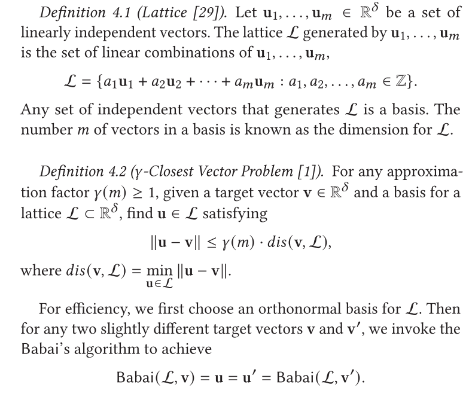

##### 3.3.5 来自指纹的密钥

​	**大多数研究采用指纹编码来表示指纹，指纹是一个640维的整数向量[11,58]。** 然而，指纹是旋转可变的，因此旋转指纹图像通常会导致不同的指纹，如[58]所述，**这不适合我们在3.2节中的第一个AFEM结构。 此外，640维向量对于现实世界的应用来说不够轻量级。**

​	另一种指纹识别方法是基于细节点的指纹表示，它由一组细节点组成[35]。具体地说，人的指纹是单个手指表面上独特的脊和谷图案。 细节点定义为脊线分裂或结束的局部不连续点的位置，通常表示为: (1) X坐标 (2)Y坐标 (3)对应于细节点脊和水平线之间的角度的方向，以度数表示。为了在不同质量的指纹图像中提取高精度的细节点，分割算法首先从噪声背景中分离前景。 然后，在不引入虚假信息的情况下，利用图像增强算法保留了原始脊流流型。最后，通过二值化细节点提取实现细节点的精确定位。

​	由于基于细节点的指纹表示产生了一组细节点，因此它适合于我们在3.3节中的第二个AFEM构造的实例化。 此外，我们注意到，一个高质量的指纹通常包含大约40￣100个细节点，而一个部分的指纹包含的细节点要少得多（大约20￣30个）。 与指纹编码相比，我们的Bake协议的性能得到了显著的提高，指纹向量集较小。

**为了提高Bake协议的实用性，我们提出了一种基于细节点的指纹向量集生成算法，其中指纹包含的细节点数目是指纹向量集的大小。**

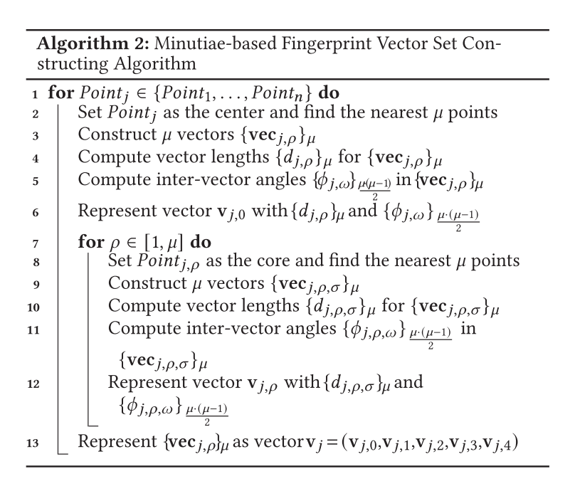

###  
### 4.安全性

不做过多叙述，干脆不说了

### 5.评价

**我们给出了与现有解的渐近比较以及在我们实现上的实验结果。**

#### 5.1 渐进比较

与现有解决方案的渐近比较如表1所示，**其中我们的生物特征向量的BAKE协议表示为BAKE-1，而生物特征向量集的BAKE-2协议表示为BAKE-2**。 注意，FPAKE[19]是一**个对称原语，它将生物特征传递给接收者，从而不满足生物特征隐私的设计目标**，而Fuzzy APAKE[21]是一个非对称原语，具有与BAKE相似的目标。

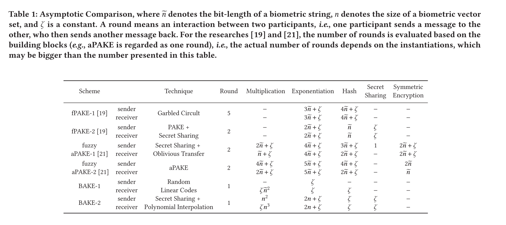

#### 5.2 实验

为了衡量我们的烘焙协议的性能，我们用Python实现了一个原型，使用笔记本电脑，Intel Core i5-8300H CPU@2.30GHz和8 GB RAM。

 为了确保来自同一用户的生物特征密钥被认为是近的，而来自不同用户的生物特征密钥被认为是远的，通过进行实验来选择参数（例如）以获得适当的精度。	

我们首先在两个实际数据集上研究了我们的BAKE协议的性能。 **对于虹膜**，我们将虹膜码转换为4种情况：**16维向量、32维向量、64维向量和128维向量**。 **对于指纹**，我们使用了第三届国际指纹验证竞赛(FVC2004)[36]中的四个数据库，其中DB1和DB2所包含的指纹向量集大小相似，而扭曲的DB3和合成的DB4所提取的噪声点较多，导致指纹向量集大小较大。

**我们的Bake协议中每个算法的计算代价如表2所示。** 由于生物特征向量的AFEM结构中只有一个Elgamal类操作，而生物特征向量集的AFEM结构中有Elgamal类操作，**因此我们在IRISCode上的协议比在FVC2004上的协议效率更高。 但从计算开销的角度来看，两种协议都适合实际应用。**

**通信开销包括在Keygen阶段传输公钥和在AKE阶段传输封装的消息，**如表3所示。 同样，**我们可以得出结论，就通信开销而言，这两个协议在实践中是有效的，即使对于资源模拟网络也是如此。**

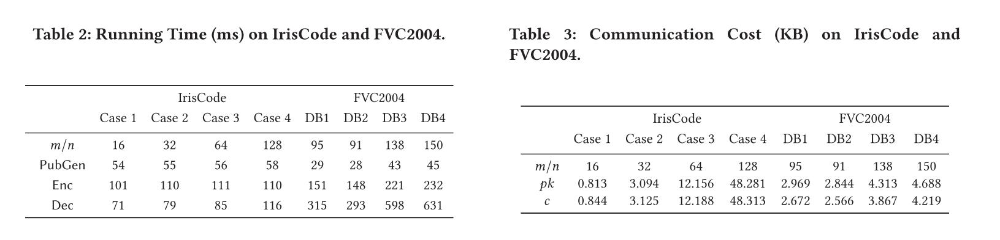

##### Further Results.

然后，**我们研究了我们的Bake协议的计算成本与生物特征密钥的大小。**

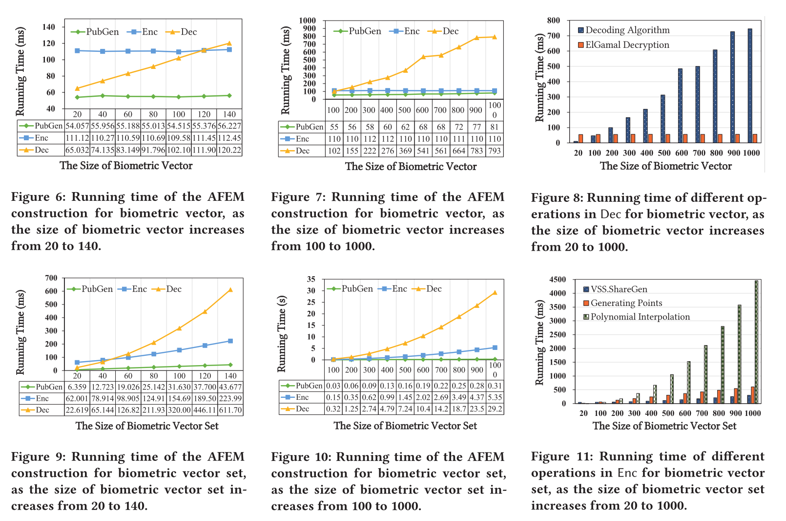

BAKE-1中算法的时间消耗如图6和图7所示。 PUBGEN的运行时间最小，且增长缓慢，随着**生物特征向量**的增大，ENC曲线平滑，因为ENC只涉及一个类似ELGAMAL的加密操作。 **对于dec，时间消耗随着增加而大幅增长，并且在=600时超过0.5秒，这类似于一般的生物认证[53]。**图8进一步描绘了DEC的详细耗时，其中≥200时以译码算法为主。

BAKE-2中算法的时间消耗如图9和图10所示，这意味着这三种算法的运行时间随着生物特征向量集大小的增加而增加。 在=500和=200时，ENC和DEC的时间消耗分别超过1秒，比现有的双因素认证方法（平均至少13秒）效率更高[41]。 我们还在enc和dec中实验了不同的操作，如图11和图12所示。 随着时间的增加，ENC中最耗时的运算是多项式插值。 在DEC中，秘密重构和多项式求值是很耗时的运算。

##### BAKE 与 Fuzzy aPake的比较

**FPAKE[19]是一个对称原语，它将生物特征传递给接收者，从而不满足生物特征隐私的设计目标，而Fuzzy APAKE[21]是一个非对称原语，具有与BAKE相似的目标。**

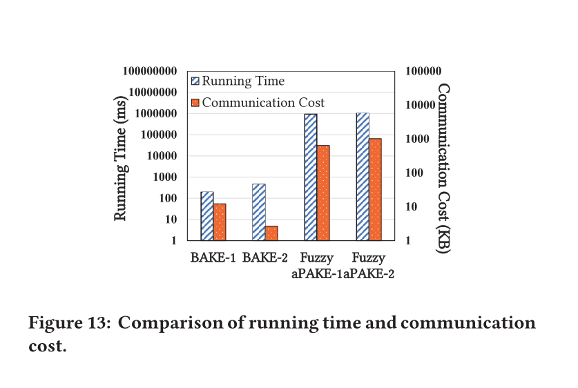

### 6.相关工作与总结

为了方便社会生活中的安全消息传递，我们提出了一个Bake框架，该框架支持同步和异步场景，并且不需要在终端中存储任何秘密，包括生物特征。 我们提出了一个名为AFEM的密码原语，使只有具有相似生物特征的参与者才能获得用相应的公钥封装的消息。 我们给出了AFEM的两个结构，并在我们的Bake框架中用虹膜和指纹初始化了它们。 安全性分析表明Bake是安全的，实验结果表明Bake是实用的。
